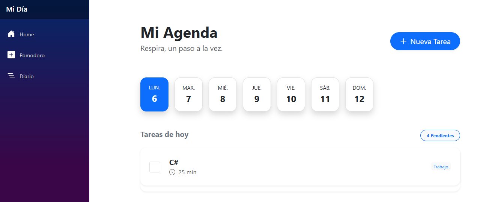
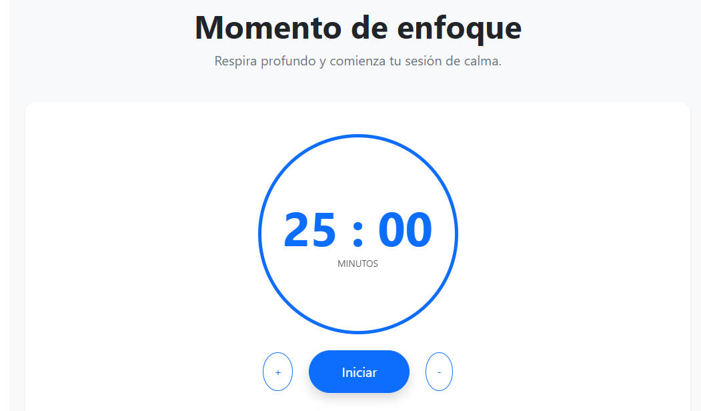
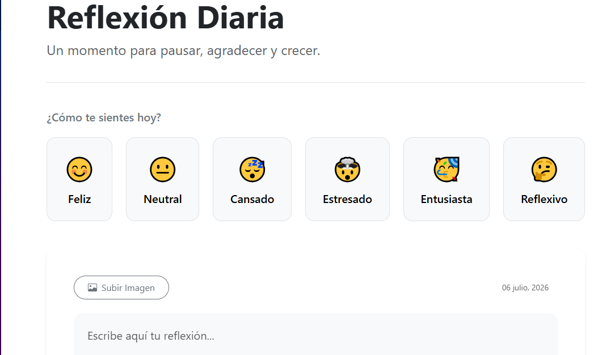
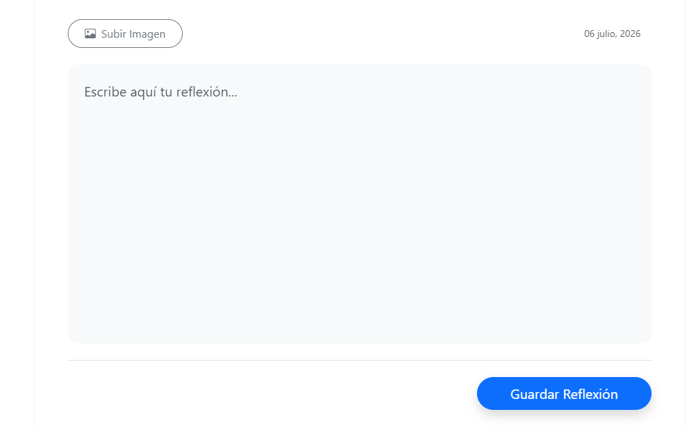

# Mi Día — Productividad Calma

Aplicación web de productividad personal desarrollada con **Blazor Server**, **.NET 10** y **MongoDB Atlas**, diseñada para ayudar a los usuarios a organizar sus actividades diarias, mejorar su concentración y registrar reflexiones sobre su día.

## Funcionalidades

### Agenda diaria

* Crear, editar tareas.
* Organizar las actividades del día.
* Marcar tareas como completadas.

### Temporizador Pomodoro

* Temporizador para sesiones de enfoque.
* Tiempo de trabajo configurable según las necesidades del usuario.

### Diario de reflexión

* Registrar cómo fue el día.
* Seleccionar el estado de ánimo.
* Subir imágenes utilizando Cloudinary para complementar cada entrada.

## Tecnologías utilizadas

* **Frontend / Backend:** C# · Blazor Server · .NET 10
* **Base de datos:** MongoDB Atlas
* **Almacenamiento de imágenes:** Cloudinary

## Arquitectura

El proyecto está desarrollado siguiendo los principios de **Clean Architecture**, organizado en cuatro capas:

* **Domain**
* **Application**
* **Infrastructure**
* **Web**

Esta arquitectura permite mantener una clara separación de responsabilidades, facilitando el mantenimiento, la escalabilidad y las pruebas del sistema.

## Capturas

## Autor

**Michell Code**
